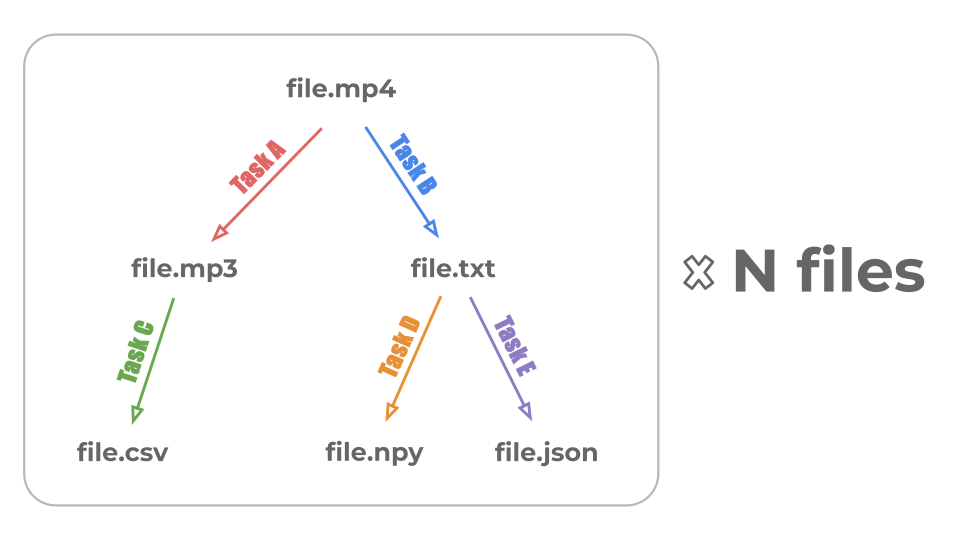

# Pipelines

!!! note

    This guide assumes you are familiar with TigerFlow [tasks](task.md).
    Please review how to create and use tasks in TigerFlow before proceeding.

In TigerFlow, tasks are organized into a pipeline by creating a configuration file that
describes the tasks to be run, the resources required by each task, and the dependencies
between tasks. Tasks communicate through the file system: a parent task writes its outputs
to a designated directory, which downstream tasks monitor for new inputs.[^1] Since each task
performs embarrassingly parallel, one-to-one file processing (i.e., each input is transformed
into a single output independently of all other inputs), multiple tasks may share the same
parent, but each task can have at most one parent.

[^1]:
    TigerFlow uses the dependency information specified in the pipeline configuration
    to automatically organize input and output directories between tasks, so users do not
    need to handle this file organization manually.

!!! info "Dependency Graph"

    TigerFlow supports pipelines where the graph of task input/output files
    forms an [arborescence](https://en.wikipedia.org/wiki/Arborescence_(graph_theory)).
    That is, there is a single root file, and every other file depends on exactly one parent.
    This means that the pipeline can contain multiple root tasks (i.e., tasks that
    depend on no other tasks), but they should share the same input file.

    

Let's build on the [example](task.md#examples) from the previous section, where we created a sequence of tasks to:

1. Transcribe videos using an open-source model (Whisper)
2. Embed the transcriptions using an external API service (Voyage AI)
3. Ingest the embeddings into a single-writer database (DuckDB)

!!! info "Follow Along"

    You can follow along with the example using the code and data provided
    [here](https://github.com/princeton-ddss/tigerflow/tree/main/examples/audio_feature_extraction).
    Videos have been substituted with audio files due to intellectual property
    constraints and storage limitations, but the pipeline remains otherwise identical.

## Defining a Pipeline

A pipeline is configured using a [YAML](https://circleci.com/blog/what-is-yaml-a-beginner-s-guide/) file.
For example, the tasks above can be structured into a pipeline as follows:

```yaml title="config.yaml"
tasks:
  - name: transcribe
    kind: slurm
    module: ./transcribe.py
    input_ext: .mp4
    output_ext: .txt
    max_workers: 3
    params:
      model_file: /home/sp8538/.cache/whisper/medium.pt
    worker_resources:
      cpus: 1
      gpus: 1
      memory: 8G
      time: 02:00:00
      sbatch_options:
        - "--mail-user=sp8538@princeton.edu"
    setup_commands:
      - module purge
      - module load anaconda3/2024.6
      - conda activate tiktok
  - name: embed
    depends_on: transcribe
    kind: local_async
    module: ./embed.py
    input_ext: .txt
    output_ext: .json
    keep_output: false
    concurrency_limit: 10
    params:
      model: voyage-4-lite
    setup_commands:
      - module purge
      - module load anaconda3/2024.6
      - conda activate tiktok
  - name: ingest
    depends_on: embed
    kind: local
    module: ./ingest.py
    input_ext: .json
    keep_output: false
    params:
      db_path: /home/sp8538/tiktok/pipeline/tigerflow/demo/results/test.db
    setup_commands:
      - module purge
      - module load anaconda3/2024.6
      - conda activate tiktok
```

where:

- `name` specifies the task name. Must start with a letter and contain only letters, digits, hyphens, or underscores. Used for directory paths, CLI arguments, and Slurm job names.
- `kind` specifies the task type (one of: `local`, `local_async`, or `slurm`).
- `module` specifies the Python module defining task logic. Can be the path to a user-defined task (e.g., `/path/to/transcribe.py`) or the import path of a library task (e.g., `tigerflow.library.echo`). Care should be taken when using a relative file path as it may resolve incorrectly when running the pipeline.
- `depends_on` specifies the name of the parent task whose output is used as input for the current task.
- `keep_output` specifies whether to retain output files from the current task. If unspecified, it defaults to `true`.
- `params` specifies custom parameters to pass to the task (see [Custom Parameters](task.md#custom-parameters)).
- `setup_commands` specifies a list of Bash commands to run before starting the task. This can be used to activate a virtual environment required for the task logic.
- `max_workers` is a field applicable only to Slurm tasks. It specifies the maximum number of parallel workers used for auto-scaling.
- `worker_resources` is a section applicable only to Slurm tasks. It specifies compute, memory, and other resources to allocate for each worker.
- `concurrency_limit` is a field applicable only to local asynchronous tasks. It specifies the maximum number of coroutines (e.g., API requests) that may run concurrently at any given time (excess coroutines are queued until capacity becomes available).

## Staging

By default, a pipeline stages all matching files from the input directory immediately.
**Staging middleware** lets you control _which_ files get staged and _how many_ are staged
at a time. Middleware steps are defined under the `staging.steps` key in the pipeline
configuration and are applied in order, forming a pipeline of filters, limits, and
transformations on the list of candidate files.

```yaml title="config.yaml"
staging:
  steps:
    - kind: min_size
      bytes: 1024
    - kind: filename_match
      pattern: "^recording_\\d+"
    - kind: sort_by
      key: mtime
    - kind: max_batch
      count: 20
tasks:
  # ...
```

In this example, only files that are at least 1 KB and whose names match the given pattern
are staged, sorted by modification time (oldest first), in batches of up to 20 per polling
cycle.

### Built-in Middleware

#### Filters

Filters remove candidates that do not meet a criterion. All remaining candidates are passed
to the next step.

| Kind | Description | Parameters |
| ---- | ----------- | ---------- |
| `min_size` | Keep files at least this large | `bytes` (int, required) |
| `max_size` | Keep files at most this large | `bytes` (int, required) |
| `min_age` | Keep files older than a threshold (by last modification time) | `seconds` (float, required) |
| `filename_match` | Keep files whose names match a regex pattern | `pattern` (str, required) |
| `companion_file` | Keep files that have a companion file with the given extension | `ext` (str, required) |

For example, `min_age` can prevent staging files that are still being written, and
`companion_file` can gate staging on an external signal (e.g., `recording_001.done`
alongside `recording_001.mp4`).

#### Limits

Limits control how many files are staged.

| Kind | Description | Parameters |
| ---- | ----------- | ---------- |
| `max_staged` | Cap the total number of files staged in the pipeline at any time | `count` (int, required) |
| `max_batch` | Cap the number of files staged per polling cycle | `count` (int, required) |

!!! tip

    Place limits _after_ filters and sorting so that the most relevant files are
    prioritized.

#### Sorting

| Kind | Description | Parameters |
| ---- | ----------- | ---------- |
| `sort_by` | Sort candidates before limits are applied | `key` (`name`, `size`, or `mtime`; default: `name`), `reverse` (bool; default: `false`) |

### Custom Middleware

For logic not covered by the built-in middleware, you can provide a custom callable
using the `callable` kind:

```yaml
staging:
  steps:
    - kind: callable
      function: "my_module:my_filter"
```

The callable must accept two positional arguments --- a list of `Path` objects (the
candidates) and a `StagingContext` --- and return a filtered list of `Path` objects:

```python title="my_module.py"
from pathlib import Path
from tigerflow.staging import StagingContext

def my_filter(candidates: list[Path], context: StagingContext) -> list[Path]:
    # Example: only stage files when fewer than 100 are already staged
    if context.staged >= 100:
        return []
    return candidates
```

The `StagingContext` provides a read-only view of the current pipeline state:

| Field | Type | Description |
| ----- | ---- | ----------- |
| `waiting` | `int` | Files in the input directory not yet staged |
| `staged` | `int` | Files staged but not yet completed |
| `completed` | `int` | Files that have finished all tasks |
| `failed` | `int` | Total error files across all tasks |
| `input_dir` | `Path` | The pipeline's input directory |
| `output_dir` | `Path` | The pipeline's output directory |

!!! warning

    If a custom callable raises an exception, it returns an empty list (no files staged)
    and a warning is logged. Make sure your callable handles edge cases gracefully.

## Running a Pipeline

Assuming the configuration file and task scripts are in the current directory,
we can run the pipeline as follows:

=== "Command"

    ```bash
    tigerflow run config.yaml path/to/data/ path/to/results/
    ```

=== "Output"

    ```log
    2025-09-22 09:20:10 | INFO     | Starting pipeline execution
    2025-09-22 09:20:10 | INFO     | [transcribe] Starting as a SLURM task
    2025-09-22 09:20:10 | INFO     | [transcribe] Submitted with Slurm job ID 847632
    2025-09-22 09:20:10 | INFO     | [embed] Starting as a LOCAL_ASYNC task
    2025-09-22 09:20:10 | INFO     | [embed] Started with PID 3007442
    2025-09-22 09:20:10 | INFO     | [ingest] Starting as a LOCAL task
    2025-09-22 09:20:10 | INFO     | [ingest] Started with PID 3007443
    2025-09-22 09:20:10 | INFO     | All tasks started, beginning pipeline tracking loop
    2025-09-22 09:20:10 | INFO     | [transcribe] Status changed: INACTIVE -> PENDING (Reason: (None))
    2025-09-22 09:20:10 | INFO     | [embed] Status changed: INACTIVE -> ACTIVE
    2025-09-22 09:20:10 | INFO     | [ingest] Status changed: INACTIVE -> ACTIVE
    2025-09-22 09:20:11 | INFO     | Staged 91 new file(s) for processing
    2025-09-22 09:20:31 | INFO     | [transcribe] Status changed: PENDING (Reason: (None)) -> ACTIVE (0 workers)
    2025-09-22 09:21:01 | INFO     | [transcribe] Status changed: ACTIVE (0 workers) -> ACTIVE (3 workers)
    2025-09-22 09:21:54 | ERROR    | [embed] 4 failed file(s)
    2025-09-22 09:21:55 | INFO     | Completed processing 25 file(s)
    2025-09-22 09:22:05 | ERROR    | [embed] 1 failed file(s)
    2025-09-22 09:22:05 | INFO     | Completed processing 7 file(s)
    2025-09-22 09:22:15 | ERROR    | [embed] 1 failed file(s)
    2025-09-22 09:22:15 | INFO     | Completed processing 13 file(s)
    2025-09-22 09:22:25 | INFO     | Completed processing 11 file(s)
    2025-09-22 09:22:35 | INFO     | Completed processing 3 file(s)
    2025-09-22 09:22:45 | INFO     | Completed processing 5 file(s)
    2025-09-22 09:22:55 | ERROR    | [embed] 1 failed file(s)
    2025-09-22 09:22:55 | INFO     | Completed processing 8 file(s)
    2025-09-22 09:23:05 | ERROR    | [embed] 1 failed file(s)
    2025-09-22 09:23:05 | INFO     | Completed processing 4 file(s)
    2025-09-22 09:23:15 | INFO     | Completed processing 6 file(s)
    2025-09-22 09:23:55 | INFO     | Completed processing 1 file(s)
    2025-09-22 09:23:55 | INFO     | No more files to process, starting idle time count
    2025-09-22 09:25:06 | INFO     | [transcribe] Status changed: ACTIVE (3 workers) -> ACTIVE (1 workers)
    2025-09-22 09:25:46 | INFO     | [transcribe] Status changed: ACTIVE (1 workers) -> ACTIVE (0 workers)
    2025-09-22 09:33:48 | WARNING  | Idle timeout reached, initiating shutdown
    2025-09-22 09:33:48 | INFO     | Shutting down pipeline
    2025-09-22 09:33:48 | INFO     | [embed] Terminating...
    2025-09-22 09:33:48 | INFO     | [ingest] Terminating...
    2025-09-22 09:33:48 | INFO     | [transcribe] Terminating...
    2025-09-22 09:33:49 | ERROR    | [transcribe] Status changed: ACTIVE (0 workers) -> INACTIVE (Reason: CANCELLED+)
    2025-09-22 09:33:50 | ERROR    | [embed] Status changed: ACTIVE -> INACTIVE (Exit Code: 143)
    2025-09-22 09:33:50 | ERROR    | [ingest] Status changed: ACTIVE -> INACTIVE (Exit Code: 143)
    2025-09-22 09:33:51 | INFO     | Pipeline shutdown complete
    ```

!!! tip

    Run each task individually (see [examples](task.md#examples)) to ensure
    they work correctly before executing the entire pipeline.

The console output shows that the pipeline:

- Runs like a server, "listening" for and staging new files for processing
- Acts as a central orchestrator that launches, monitors, and manages the lifecycle of tasks
- Optimizes resource usage through autoscaling and idle timeout

By default, pipelines time out after 10 minutes of inactivity (i.e., when there are no more files
left to process). We can override this behavior using the `--idle-timeout` option, like so:

```bash
# Time out after 30 days of inactivity
tigerflow run config.yaml path/to/data/ path/to/results/ --idle-timeout 43200
```

Before the timeout threshold is reached, the pipeline will remain active with a minimal
resource footprint, ready to stage and process any new files placed in the input directory.
This behavior is useful for streaming-like workflows where data may arrive sporadically.

!!! info

    To see all available options for the `run` subcommand, run `tigerflow run --help`.

### Background Mode

For long-running pipelines, especially on remote servers where you may disconnect from the terminal,
we can run the pipeline in the background using the `--background` flag:

=== "Command"

    ```bash
    tigerflow run config.yaml path/to/data/ path/to/results/ --background
    ```

=== "Output"

    ```
    Started (pid 12345)
    ```

The pipeline starts as a detached process, returning control to the terminal immediately.
All output is written to `.tigerflow/run.log` in the output directory.

!!! note

    Only one pipeline can run against a given output directory at a time. Attempting to start
    a second pipeline targeting the same output directory will fail with an error indicating
    that a pipeline is already running.

## Managing Running Pipelines

### Stopping a Pipeline

To gracefully stop a running pipeline:

```bash
tigerflow stop path/to/results/
```

The pipeline will finish processing any in-progress files before shutting down.
Use `--force` for immediate termination without waiting for cleanup.

Since the pipeline has been configured to retain output files only for the transcription task,
the output directory (i.e., `path/to/results/`) will look as follows:

```
path/to/results/
├── .tigerflow/
└── transcribe/
    ├── 1.txt
    ├── 2.txt
    └── ...
```

where `.tigerflow/` is an internal directory storing the pipeline's operational state and related metadata.

!!! warning

    `.tigerflow/` is what enables resuming a previous pipeline run, so it should not be deleted or modified.

## Monitoring a Pipeline

The `report` command provides a dashboard view of a pipeline's status, progress, metrics,
and errors:

=== "Command"

    ```bash
    tigerflow report path/to/results/
    ```

=== "Output"

    ```
    ╭─ tigerflow report ──────────────────────────────────────────────────────────────────────────╮
    │                                                                                             │
    │ Status:  ● running (pid 45760)                                                              │
    │ Output:  path/to/results/                                                                   │
    │                                                                                             │
    │ Progress: ○ 83 staged → ◐ 1 in progress → ✓ 13 processed, ✗ 3 failed                        │
    │                                                                                             │
    │   transcribe  ━━━━━━────────────────────────────────── 16 / 100, 1 failed                   │
    │   embed       ━━━━━━━━━━━━━━━━━━━━━━━━━━━━━━━━━━━━━─── 13 / 16, 2 failed                    │
    │   ingest      ━━━━━━━━━━━━━━━━━━━━━━━━━━━━━━━━━━━━━━━━ 13 / 13                              │
    │                                                                                             │
    │ Metrics:                                                                                    │
    │                                                                                             │
    │   transcribe      ▄▂▆▃█▅▂▁▃▇▄▂▅▃▆▁  1.2s – 3.8s (2.1s avg)                                  │
    │   embed              █▃▁▅▂▇▄▂▆▁▃▅▂  318ms – 812ms (497ms avg)                               │
    │   ingest             ▂█▄▁▅▃▇▂▄▆▁▃▅  42ms – 187ms (96ms avg)                                 │
    │                                                                                             │
    │ Errors: 3                                                                                   │
    │   transcribe  0016.mp4  RuntimeError: Failed to load audio: ffmpeg error (see stderr ...    │
    │   embed  0004.txt  RateLimitError: 429 Too Many Requests                                    │
    │   embed  0028.txt  RateLimitError: 429 Too Many Requests                                    │
    │                                                                                             │
    ╰─────────────────────────────────────────────────────────────────────────────────────────────╯
    ```

    The actual terminal output is colorized (green for processed, yellow for in progress,
    red for errors).

where `path/to/results/` must be a valid output directory containing `.tigerflow/`.

The dashboard displays four sections:

- **Status** — whether the pipeline is running or stopped, along with its process ID.
- **Progress** — a pipeline-level summary (staged → in progress → processed) and per-task
  progress bars showing how many files each task has processed.
- **Metrics** — per-task sparklines with min, max, and average processing durations
  (only shown when metric data is available).
- **Errors** — a count and summary of the first five errors, including the task name,
  input file, and exception details.

### Watch Mode

Use the `--watch` (or `-w`) flag to continuously refresh the dashboard every second,
providing a live view of pipeline activity:

```bash
tigerflow report path/to/results/ --watch
```

Press `Ctrl+C` to exit watch mode.

### JSON Output

For scripting and programmatic access, use the `--json` flag to output
machine-readable JSON:

```bash
tigerflow report path/to/results/ --json
```

The JSON output includes `status`, `progress`, `metrics`, and `errors` sections.
Use `--include` to request only specific sections:

```bash
# Only status and progress
tigerflow report path/to/results/ --json --include status,progress

# Only errors
tigerflow report path/to/results/ --json --include errors
```

!!! note

    The `--watch` flag cannot be combined with `--json`.
